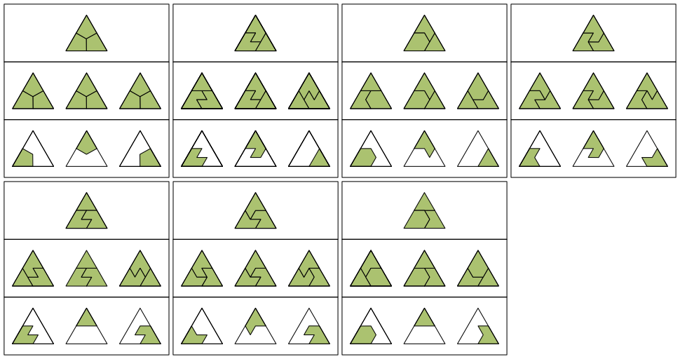
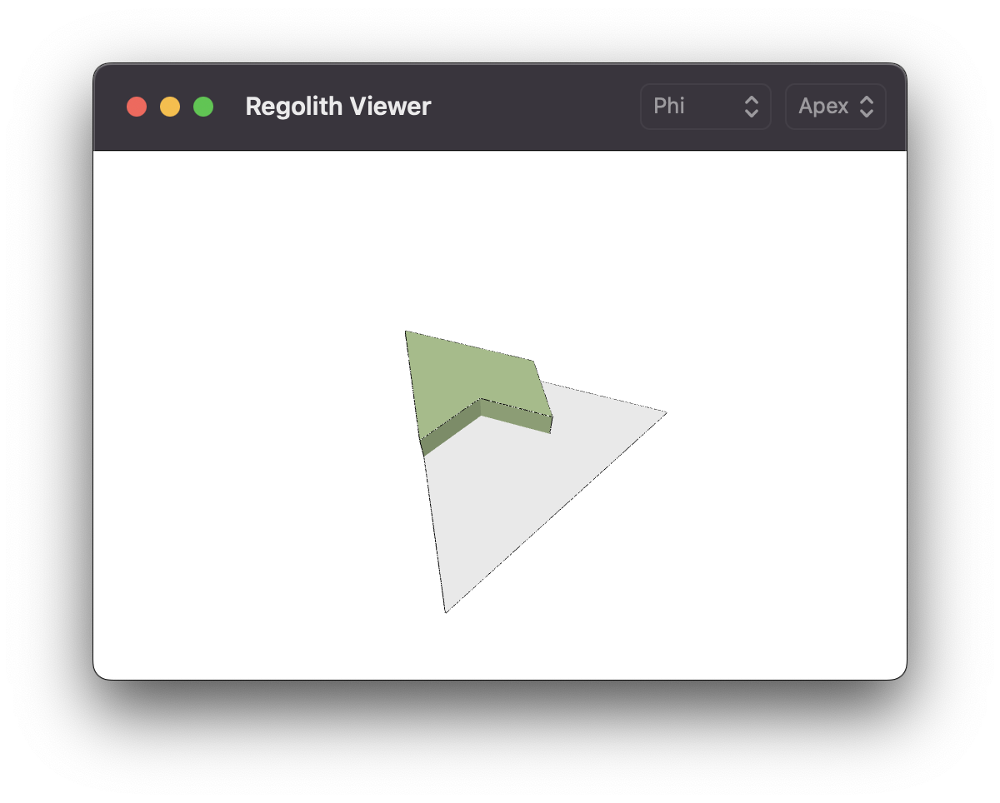

[]()
[](https://developer.apple.com/swift)
[](https://opensource.org/licenses/MIT)

- [Introduction](#regolith)
- [Installation](#installation)
- [Implementation](#implementation)
- [Credits](#credits)

# Regolith
Regolith is a Swift package written to facilitate the generation of terrain tilesets for use in [Wave Function Collapse](https://en.wikipedia.org/wiki/Wave_function_collapse) and [Marching Cube](https://en.wikipedia.org/wiki/Marching_cubes) based terrain generation systems. Regolith generates a comprehensive, low poly set of triangular kite configurations that can be used as a tileset for terrain mesh generation. The aim of this project is to generate simplistic geometric shapes that tesselate correctly on a 3D grid system without the use of any third party modelling tools.

Regolith was built as a prototyping tool to allow for rapid development and visual feedback of terrain tilesets that are generated programmatically. By pre-generating tile variations we can reduce the amount of time and effort required to create a complete set by hand. An example `Regolith Viewer` application is included to facilitate the visualisation of each triangle kite configuration to validate the generated mesh output.

# Installation
To install using Swift Package Manager, add this to the `dependencies:` section in your Package.swift file:

```swift
.package(url: "https://github.com/zilmarinen/Regolith.git", .upToNextMinor(from: "0.1.0")),
```

## Dependencies
[Deltille](https://github.com/zilmarinen/Deltille) is a utility framework designed to encapsulate the mathematical principles and concepts of a coordinate system defined within a regular tiling of a triangular grid.

[Bivouac](https://github.com/zilmarinen/Bivouac) is a Swift framework providing extensions, utility methods and commonly used design patterns often used when working with [`SceneKit`](https://developer.apple.com/documentation/scenekit).

[Euclid](https://github.com/nicklockwood/Euclid) is a Swift library for creating and manipulating 3D geometry and is used extensively within this project for mesh generation and vector operations.

[PeakOperation](https://github.com/3Squared/PeakOperation) is a Swift microframework providing enhancement and conveniences to [`Operation`](https://developer.apple.com/documentation/foundation/operation). 

## License

This project is licensed under the MIT License - see the [LICENSE.md](LICENSE.md) file for details.

## Implementation
An sample implementation of how you can use `Regolith` in your own project can be seen in the `Regolith Viewer` example application included with this framework. Regolith provides two operations to generate either a single `Kite` mesh using `KiteMeshOperation` or a cache of all `Kite` `Pattern` sets with `RegolithCacheOperation`. 

```swift
let operation = KiteMeshOperation(kite: kite,
                                  colorPalette: colorPalette,
                                  elevation: elevation,
                                  stencil: stencil)
        
operation.enqueue(on: operationQueue) { [weak self] result in
    
    guard let self else { return }
    
    switch result {
        
    case .success(let mesh): //use mesh
        
    case .failure(let error): //handle error
    }
}
```

## Kites & Patterns
Using a concept known as [Ortho-Tiling](https://www.boristhebrave.com/2023/05/31/ortho-tiles/) we can predefine a custom set of `Kite` configurations that encode the vertices that form the perimeter of each shape. Triangular tile variations can be derived by combining kite triplets to create different tessellating `Pattern` sets. Additional tiling variations can also be achieved by rotating the base pattern in intervals of 120 degrees. Whilst only seven such kites are needed here to describe a complete set, an additional kite is defined as an optimisation should a triangle have a uniform elevation and material distribution along all vertices.



## Meshes
The geometry for each kite is generated from its predefined vertices and extruded to create a 3D `Mesh` for both the base and apex of a tile. The resulting meshes can be used within [CSG](https://en.wikipedia.org/wiki/Constructive_solid_geometry) operations to create more complex patterns. Combining the results of the CSG operations on different `Kite` sets allows for multiple styles within a single tile which vastly increases the diversity of the resulting tileset. 



# Credits

The Regolith framework is primarily the work of [Zack Brown](https://github.com/zilmarinen).

Heavily inspired by;
- [Oskar Stalberg](https://oskarstalberg.tumblr.com)'s work on [WFC](https://www.youtube.com/watch?v=0bcZb-SsnrA) systems for [Townscaper](https://www.townscapergame.com) and [Bad North](https://twitter.com/BadNorthGame).
- [Boris the Brave](https://twitter.com/boris_brave)'s superb tutorials on [WFC](https://www.boristhebrave.com/2020/04/13/wave-function-collapse-explained/) and [Model Synthesis](https://www.boristhebrave.com/2021/10/26/model-synthesis-and-modifying-in-blocks/).


