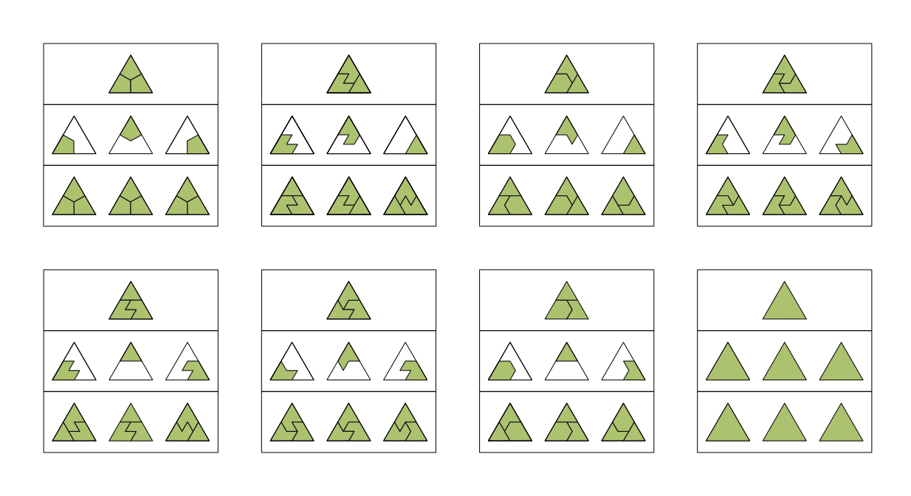

# Introduction
Regolith is a Swift package written to facilitate the generation of terrain tilesets for use in [Wave Function Collapse](https://en.wikipedia.org/wiki/Wave_function_collapse) and [Marching Cube](https://en.wikipedia.org/wiki/Marching_cubes) based terrain generation systems. Primarily built for usage with [Harvest](https://github.com/zilmarinen/Harvest) and [Meadow](https://github.com/zilmarinen/Meadow), Regolith generates a comprehensive, low poly set of triangle kite configurations that can be used as a tileset for terrain mesh generation.
## About
Regolith was built as a prototyping tool to allow for rapid development and visual feedback of terrain tilesets that are generated programmatically. By pre-generating tile variations we can reduce the amount of time and effort required to create a complete set by hand. An example `Regolith Viewer` application is included to facilitate the visualisation of each triangle kite configuration to validate the generated mesh output.

## Inspiration
Heavily inspired by [Oskar Stålberg](https://oskarstalberg.tumblr.com)'s work on [WFC](https://www.youtube.com/watch?v=0bcZb-SsnrA) systems for [Townscaper](https://www.townscapergame.com) and [Bad North](https://twitter.com/BadNorthGame) and also [BorisTheBrave](https://twitter.com/boris_brave)'s superb tutorials on [WFC](https://www.boristhebrave.com/2020/04/13/wave-function-collapse-explained/) and [Model Synthesis](https://www.boristhebrave.com/2021/10/26/model-synthesis-and-modifying-in-blocks/), the aim of this project is to generate complex geometric shapes that tesselate correctly on a 3D grid system without the use of any third party modelling tools.

# Kites & Patterns

Using a concept called [Ortho-Tiling](https://www.boristhebrave.com/2023/05/31/ortho-tiles/) we can predefine a custom set of `Kite` configurations that encode the vertices that define each shape. Only seven such `Kite`s are needed here to describe a complete set. Triangle tile variations can be derived by combining `Kite` triplets to create different tessellating `Pattern`s. Additional tiling variations can also be achieved by rotating the base `Pattern`.

# Meshes

The geometry for each `Kite` is generated from its predefined vertices and extruded to create a 3D `Mesh` for both the base and apex of a tile.  The resulting `Mesh`es can be used within [CSG](https://en.wikipedia.org/wiki/Constructive_solid_geometry) operations to create more complex `Pattern`s. Combining the results of the CSG operations on different `Kite`s allows for multiple styles within a single tile which vastly increases the diversity of the resulting tileset. 

## Dependencies
[Euclid](https://github.com/nicklockwood/Euclid) is a Swift library for creating and manipulating 3D geometry and is used extensively within this project for mesh generation and vector operations.

[PeakOperation](https://github.com/3Squared/PeakOperation) is a Swift microframework providing enhancement and conveniences to [`Operation`](https://developer.apple.com/documentation/foundation/operation). 

